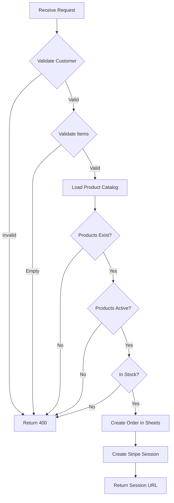

# API Documentation

> FC Ardentis - Backend API Reference

## Table of Contents

- [Overview](#overview)
- [Endpoints](#endpoints)
  - [POST /api/checkout](#post-apicheckout)
  - [POST /api/stripe-webhook](#post-apistripe-webhook)
- [Error Handling](#error-handling)
- [Rate Limiting](#rate-limiting)

---

## Overview

The FC Ardentis API consists of serverless functions deployed on Vercel. These functions handle:

1. **Checkout Processing** - Creating orders and Stripe sessions
2. **Webhook Handling** - Processing Stripe payment events

Base URL: `https://fc-ardentis.vercel.app/api`

---

## Endpoints

### POST /api/checkout

Creates a new order and Stripe checkout session.

#### Request

```typescript
POST /api/checkout
Content-Type: application/json

{
  "customer": {
    "first_name": string,    // Required
    "last_name": string,     // Required
    "email": string,         // Required, valid email
    "phone": string,         // Optional
    "note": string           // Optional
  },
  "items": [
    {
      "id": string,          // Product ID from catalog
      "quantity": number,    // Minimum: 1
      "size": string,        // e.g., "M", "L", "XL"
      "number": string,      // Jersey number (optional)
      "flocage": string      // Name printing (optional)
    }
  ]
}
```

#### Response

**Success (200)**

```json
{
  "url": "https://checkout.stripe.com/c/pay/..."
}
```

**Error (400)**

```json
{
  "error": "Missing customer name"
}
```

```json
{
  "error": "PRODUCT_NOT_FOUND:jersey-home"
}
```

```json
{
  "error": "PRODUCT_SOLDOUT:jersey-home"
}
```

**Error (500)**

```json
{
  "error": "Internal error"
}
```

#### Flow



---

### POST /api/stripe-webhook

Handles Stripe webhook events. This endpoint is called by Stripe, not by the frontend.

#### Request

```
POST /api/stripe-webhook
Content-Type: application/json
Stripe-Signature: t=...,v1=...

<raw event body>
```

#### Handled Events

| Event | Action |
|-------|--------|
| `checkout.session.completed` | Update order status to "paid" |

#### Response

**Success (200)**

```json
{
  "received": true
}
```

**Error (400)**

```
Webhook Error: No signatures found matching the expected signature
```

---

## Error Handling

### Error Codes

| Code | Meaning |
|------|---------|
| 400 | Bad Request - Invalid input data |
| 405 | Method Not Allowed - Wrong HTTP method |
| 500 | Internal Server Error |
| 502 | Bad Gateway - Google Sheets API failure |

### Error Response Format

```json
{
  "error": "Human-readable error message",
  "detail": {
    // Optional additional context
  }
}
```

### Common Errors

| Error | Cause | Solution |
|-------|-------|----------|
| `Missing customer name` | Empty first/last name | Provide valid names |
| `Invalid email` | Malformed email | Provide valid email |
| `Cart empty` | No items in request | Add items to cart |
| `PRODUCT_NOT_FOUND:id` | Product ID doesn't exist | Check product catalog |
| `PRODUCT_INACTIVE:id` | Product is disabled | Remove from cart |
| `PRODUCT_SOLDOUT:id` | Product out of stock | Remove from cart |

---

## Rate Limiting

Currently, no explicit rate limiting is implemented. Vercel's default limits apply:

- **Hobby**: 100 requests per day per IP
- **Pro**: 1000 requests per day per IP

For production, consider implementing:

1. Redis-based rate limiting
2. Cloudflare rate limiting
3. Stripe's built-in fraud detection

---

## Testing

### Local Development

```bash
# Start development server
npm run dev

# API available at http://localhost:5173/api/
```

### Stripe CLI (for webhooks)

```bash
# Install Stripe CLI
brew install stripe/stripe-cli/stripe

# Login
stripe login

# Forward webhooks to local
stripe listen --forward-to localhost:5173/api/stripe-webhook

# Trigger test event
stripe trigger checkout.session.completed
```

### cURL Examples

```bash
# Create checkout session
curl -X POST http://localhost:5173/api/checkout \
  -H "Content-Type: application/json" \
  -d '{
    "customer": {
      "first_name": "John",
      "last_name": "Doe",
      "email": "john@example.com"
    },
    "items": [{
      "id": "maillot-domicile",
      "quantity": 1,
      "size": "M"
    }]
  }'
```

