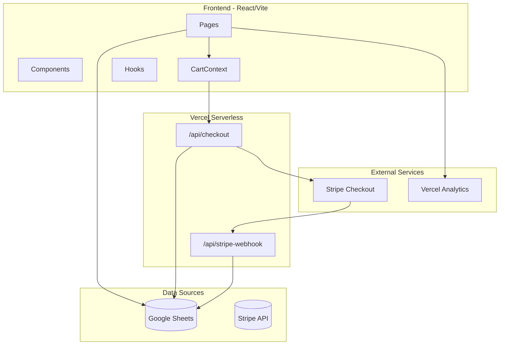
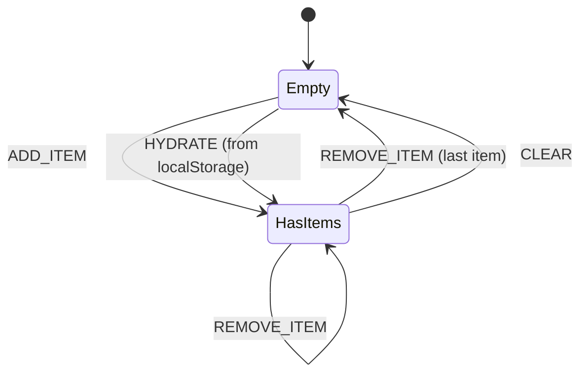
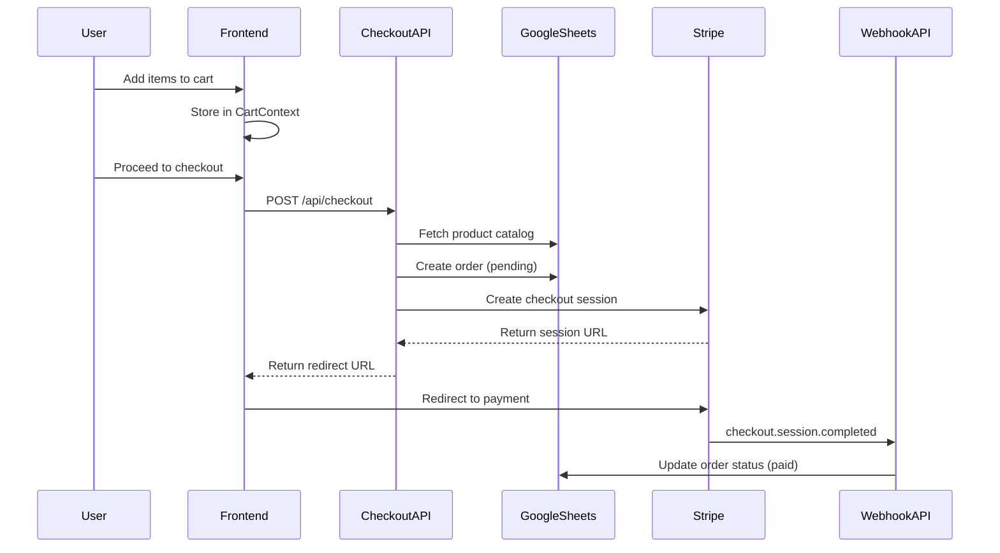

# Architecture Overview

> FC Ardentis - System Architecture Documentation

## Table of Contents

- [High-Level Architecture](#high-level-architecture)
- [Technology Stack](#technology-stack)
- [Frontend Architecture](#frontend-architecture)
- [Backend Architecture](#backend-architecture)
- [Data Flow](#data-flow)
- [Security Considerations](#security-considerations)

---

## High-Level Architecture



---

## Technology Stack

### Frontend

| Technology | Purpose | Version |
|------------|---------|---------|
| React | UI Library | 18.3.x |
| TypeScript | Type Safety | 5.8.x |
| Vite | Build Tool | 7.x |
| TailwindCSS | Styling | 3.4.x |
| shadcn/ui | UI Components | - |
| React Router | Routing | 6.30.x |
| React Query | Data Fetching | 5.x |

### Backend (Serverless)

| Technology | Purpose |
|------------|---------|
| Vercel Functions | API Endpoints |
| Stripe SDK | Payment Processing |
| Google Sheets | Data Storage |

### External Services

| Service | Purpose |
|---------|---------|
| Vercel | Hosting & Deployment |
| Stripe | Payment Gateway |
| Google Sheets | CMS for Products/Team/Events |
| Vercel Analytics | Usage Analytics |

---

## Frontend Architecture

### Directory Structure

```
src/
├── components/           # Reusable UI components
│   ├── ui/              # shadcn/ui base components
│   ├── Navigation.tsx   # Site navigation
│   ├── Footer.tsx       # Site footer
│   └── ...
├── contexts/            # React Context providers
│   └── CartContext.tsx  # Shopping cart state
├── hooks/               # Custom React hooks
│   └── use-mobile.tsx   # Mobile detection hook
├── lib/                 # Utility functions
│   └── utils.ts         # Shared utilities
├── pages/               # Route components
│   ├── Index.tsx        # Home page
│   ├── Equipe.tsx       # Team page
│   ├── Calendrier.tsx   # Calendar page
│   ├── Shop.tsx         # Shop listing
│   ├── shop/
│   │   └── [slug].tsx   # Product detail page
│   ├── Checkout.tsx     # Cart page
│   └── checkout/        # Checkout flow pages
│       ├── Details.tsx
│       ├── Success.tsx
│       ├── Cancel.tsx
│       └── Failed.tsx
└── App.tsx              # Root component with routing
```

### State Management

The application uses a combination of:

1. **React Context** - For global cart state (`CartContext`)
2. **React Query** - For server state (future implementation)
3. **Local State** - For component-specific UI state

### Cart Context Flow



---

## Backend Architecture

### API Endpoints

| Endpoint | Method | Purpose |
|----------|--------|---------|
| `/api/checkout` | POST | Create Stripe checkout session |
| `/api/stripe-webhook` | POST | Handle Stripe webhooks |

### Checkout Flow



---

## Data Flow

### Product Data Flow

1. Products are managed in Google Sheets
2. Frontend fetches CSV export on page load
3. Product data is parsed and rendered
4. Cart stores product references locally
5. Checkout validates against server-side catalog

### Order Data Flow

1. User adds items to cart (stored in localStorage)
2. User enters customer details
3. Frontend sends order to `/api/checkout`
4. API creates pending order in Google Sheets
5. API creates Stripe checkout session
6. User completes payment on Stripe
7. Stripe webhook updates order status

---

## Security Considerations

### Client-Side

- No sensitive data stored in localStorage
- Cart only stores product IDs and quantities
- All prices validated server-side

### Server-Side

- Stripe webhook signature verification
- Product prices fetched from server (not trusted from client)
- Environment variables for all secrets
- CORS configured for production domain

### Environment Variables

All sensitive configuration is stored in environment variables:

- `STRIPE_SECRET_KEY` - Stripe API key
- `STRIPE_WEBHOOK_SECRET` - Webhook signature verification
- `SHEET_ORDERS_WEBAPP_URL` - Google Apps Script endpoint
- `PRODUCTS_CSV_URL` - Product catalog URL

See [Environment Variables](./env-variables.md) for complete list.

