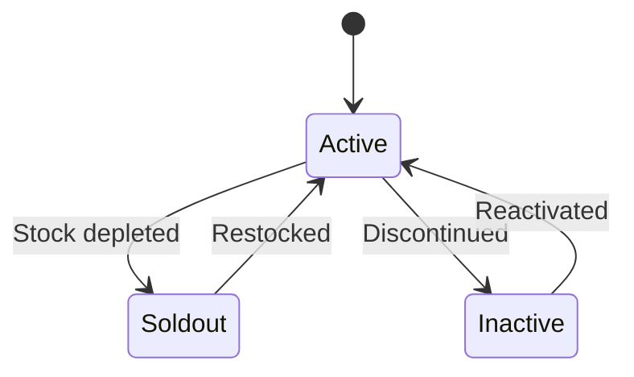
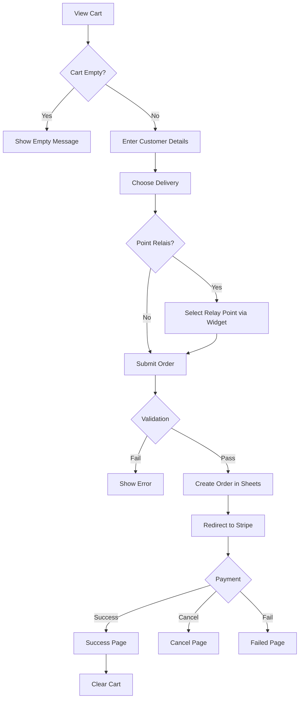
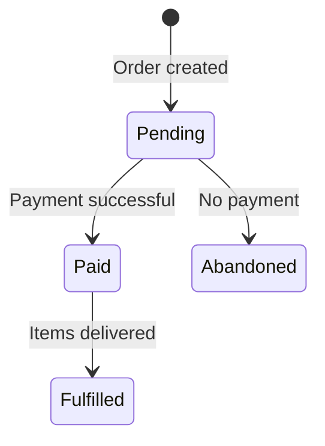
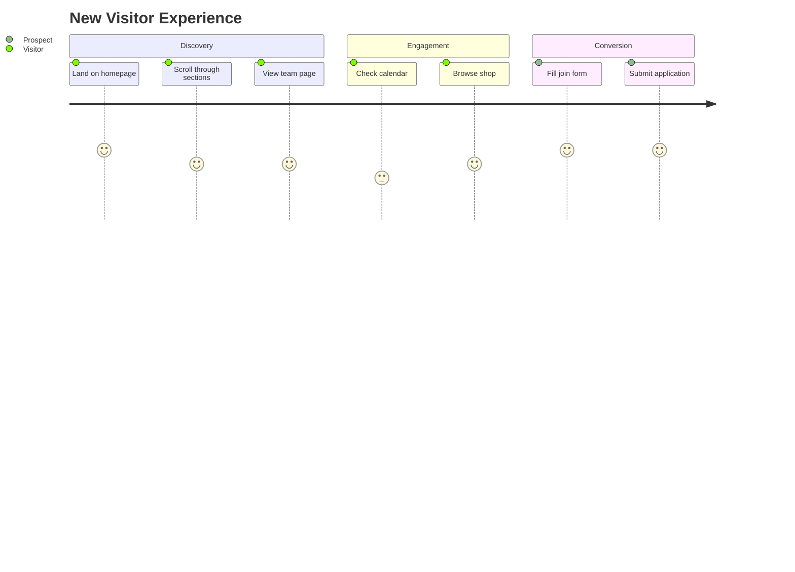
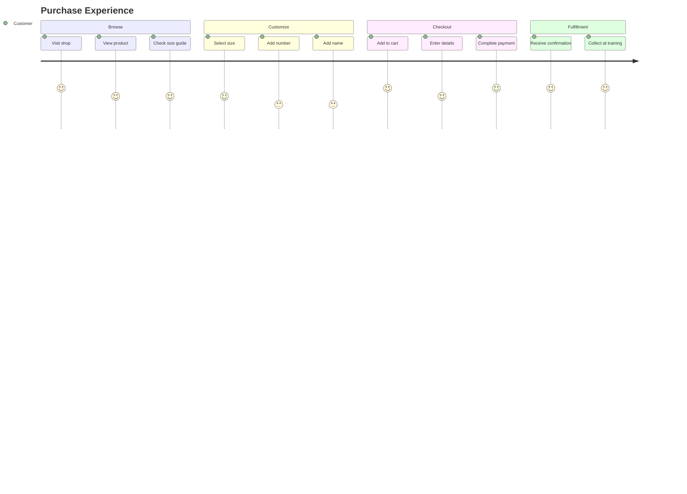

# Business Logic

> FC Ardentis - Business Rules and Domain Logic

## Table of Contents

- [Overview](#overview)
- [Shop & Products](#shop--products)
- [Cart Management](#cart-management)
- [Checkout Process](#checkout-process)
- [Order Lifecycle](#order-lifecycle)
- [Team Management](#team-management)
- [Calendar & Events](#calendar--events)
- [User Journeys](#user-journeys)

---

## Overview

FC Ardentis is a football club website with e-commerce capabilities. The primary business functions are:

1. **Club Information** - Team roster, calendar, contact
2. **Merchandise Shop** - Jerseys and shorts with customization
3. **Member Recruitment** - Join request form

---

## Shop & Products

### Product Types

| Type | French | Customization Options |
|------|--------|----------------------|
| `maillot` | Maillot | Size, Number, Name (flocage) |
| `short` | Short | Size, Number |

### Product States



| State | `active` | `soldout` | Visible | Purchasable |
|-------|----------|-----------|---------|-------------|
| Active | true | false | Yes | Yes |
| Sold Out | true | true | Yes | No |
| Inactive | false | - | No | No |

### Pricing Rules

- All prices in EUR
- Prices managed in Google Sheets
- **Server-side validation**: Frontend prices are for display only
- No discounts or coupons (currently)

### Size Guide

Available sizes: `3XS`, `2XS`, `XS`, `S`, `M`, `L`, `XL`, `2XL`, `3XL`, `4XL`, `5XL`

**Important**: Products run small. Size guide image provided per product.

---

## Cart Management

### Cart Structure

```typescript
interface CartItem {
  lineItemId: string;    // Unique line identifier
  id: string;            // Product ID
  name: string;          // Product name
  price_eur: number;     // Unit price
  quantity: number;      // Always 1 per line item
  image_url?: string;    // Product image
  size?: string;         // Selected size
  number?: string;       // Jersey number
  flocage?: string;      // Name printing
}
```

### Cart Rules

1. **One item per line**: Each cart line is unique (same product with different options = different lines)
2. **No quantity editing**: Users add/remove entire line items
3. **Persistence**: Cart stored in localStorage
4. **Validation**: Items validated against server catalog at checkout

### Cart Actions

| Action | Description |
|--------|-------------|
| `ADD_ITEM` | Add new line item to cart |
| `REMOVE_ITEM` | Remove specific line item |
| `CLEAR` | Empty entire cart |
| `SET_DELIVERY` | Set delivery method and optional relay point |
| `HYDRATE` | Load cart from localStorage |

### Delivery State

The cart stores delivery choice (persisted in localStorage):

- **Remise en main propre** (`hand`) – 0 €
- **Point Relais** (`relay`) – 5,99 €, with selected relay point (id, name, address, postcode, city, country)

---

## Checkout Process

### Flow Diagram



### Delivery Methods

| Method | Price | Description |
|--------|-------|-------------|
| `hand` | 0 € | Remise en main propre – retrait au club |
| `relay` | 5,99 € | Livraison en Point Relais (Mondial Relay / Inpost) – client chooses point via widget |

If the client selects Point Relais, they must choose a relay point (by postcode) before submitting. The selected point (id, name, address, postcode, city, country) is stored with the order. The club handles shipping manually (no Mondial Relay label API).

### Customer Data Required

| Field | Required | Validation |
|-------|----------|------------|
| First Name | Yes | Non-empty |
| Last Name | Yes | Non-empty |
| Email | Yes | Valid email format |
| Phone | No | - |
| Notes | No | - |

### Server-Side Validation

At checkout, the server:

1. **Validates customer data** – Name and email required
2. **Validates delivery** – Method must be `hand` or `relay`; if `relay`, relay point id and name required (id format: `XX-000000`)
3. **Loads product catalog** – Fresh data from Google Sheets
4. **Validates each item**:
   - Product exists
   - Product is active
   - Product is in stock
5. **Recalculates total** – Subtotal (server prices) + delivery (0 or 5,99 €)
6. **Creates pending order** – In Google Sheets (with delivery and relay point fields)
7. **Creates Stripe session** – Line items for products + one line for “Livraison Point Relais” (5,99 €) when method is `relay`

---

## Order Lifecycle

### Order States



| State | Description |
|-------|-------------|
| `pending` | Order created, awaiting payment |
| `paid` | Payment confirmed via Stripe webhook |
| `fulfilled` | Items delivered to customer (manual) |
| `abandoned` | No payment received (cleanup) |

### Order Data

Stored in Google Sheets (see [data-sources.md](data-sources.md) for full schema):

```
order_id | created_at | customer_name | customer_email | customer_phone | items | total_eur | payment_status | stripe_session_id | delivery_method | delivery_cost_eur | relay_point_id | relay_point_name | relay_point_address | relay_point_postcode | relay_point_city | relay_point_country | notes
```

- `delivery_method`: `hand` or `relay`
- `delivery_cost_eur`: 0 or 5.99
- Relay point columns populated only when `delivery_method` = `relay`

### Fulfillment

- **Delivery methods**: Remise en main propre (0 €) or Point Relais (5,99 €)
- **Delivery time**: ~2 months (custom production)
- **Hand delivery**: Items collected in person at the club
- **Point Relais**: Club ships to the selected relay point; customer picks up there (shipping handled manually by the club)

---

## Team Management

### Player Data

| Field | Purpose |
|-------|---------|
| numero | Jersey number |
| prenom | First name |
| nom | Last name |
| poste | Position |
| photo_url | Player photo |
| origine | Country/origin |
| fun_fact | Personal fact |
| joueur_prefere | Favorite player |
| matchs_joues | Games played |
| buts | Goals scored |
| passes_decisives | Assists |

### Position Mapping

| English | French |
|---------|--------|
| Goalkeeper | Gardien de but |
| Defender | Défenseur |
| Midfielder | Milieu de terrain |
| Forward | Attaquant |

### Display Order

1. Group by position (Goalkeeper → Defender → Midfielder → Forward)
2. Within group: Sort by jersey number, then by name

---

## Calendar & Events

### Event Types

| Type | Icon | Description |
|------|------|-------------|
| `match` | Trophy | Competitive match |
| `entrainement` | Dumbbell | Training session |

### Match Data

For matches:

- Home/Away teams
- Team logos
- Score (post-match)
- Result: V (Win), N (Draw), D (Loss)

### Result Calculation

If `resultat` not provided, calculated from scores:

```typescript
if (score_home > score_away) return "V";
if (score_home === score_away) return "N";
return "D";
```

### Schedule

- **Training**: Sunday 11h @ Colombes
- **Matches**: Monday or Wednesday @ Paris region

---

## User Journeys

### New Visitor Journey



### Purchase Journey



---

## Business Rules Summary

1. **Pricing**: Server-side price validation, no client trust
2. **Stock**: Binary in-stock/sold-out, no quantity tracking
3. **Customization**: Size required, number/name optional
4. **Payment**: Stripe only, no alternative methods
5. **Delivery**: In-person collection, ~2 month lead time
6. **Returns**: Contact club directly (no automated process)

