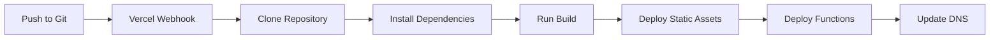

# Deployment Guide

> FC Ardentis - Vercel Deployment Documentation

## Table of Contents

- [Overview](#overview)
- [Prerequisites](#prerequisites)
- [Initial Setup](#initial-setup)
- [Environment Variables](#environment-variables)
- [Deployment Process](#deployment-process)
- [Domain Configuration](#domain-configuration)
- [Monitoring](#monitoring)
- [Rollbacks](#rollbacks)
- [Troubleshooting](#troubleshooting)

---

## Overview

FC Ardentis is deployed on [Vercel](https://vercel.com), which provides:

- Automatic deployments from Git
- Preview deployments for PRs
- Serverless functions for API routes
- Edge caching for static assets
- Built-in analytics

---

## Prerequisites

Before deploying, ensure you have:

1. **Vercel Account** - [Sign up](https://vercel.com/signup)
2. **GitHub/GitLab Repository** - Code hosted in Git
3. **Stripe Account** - [Sign up](https://stripe.com)
4. **Google Account** - For Sheets integration

---

## Initial Setup

### 1. Connect Repository

```bash
# Install Vercel CLI
npm i -g vercel

# Login to Vercel
vercel login

# Link project
vercel link
```

### 2. Configure Project

In Vercel Dashboard:

1. Go to Project Settings
2. Set Framework Preset: `Vite`
3. Set Build Command: `npm run build`
4. Set Output Directory: `dist`

### 3. Configure Serverless Functions

The `/api` directory is automatically detected. Ensure:

```json
// vercel.json
{
  "rewrites": [
    { "source": "/api/(.*)", "destination": "/api/$1" },
    { "source": "/((?!api|.*\\..*).*)", "destination": "/" }
  ]
}
```

---

## Environment Variables

### Required Variables

| Variable | Description | Example |
|----------|-------------|---------|
| `STRIPE_SECRET_KEY` | Stripe API secret key | `sk_live_...` |
| `STRIPE_WEBHOOK_SECRET` | Webhook signing secret | `whsec_...` |
| `PRODUCTS_CSV_URL` | Google Sheets products URL | `https://docs.google.com/...` |
| `SHEET_ORDERS_WEBAPP_URL` | Apps Script web app URL | `https://script.google.com/...` |

### Optional Variables

| Variable | Description | Default |
|----------|-------------|---------|
| `PUBLIC_BASE_URL` | Public site URL | Auto-detected |
| `SHEET_APP_TOKEN` | Apps Script auth token | None |

### Frontend Variables (VITE_*)

| Variable | Description |
|----------|-------------|
| `VITE_SHEET_PRODUCTS_CSV_URL` | Products CSV for frontend |
| `VITE_GOOGLE_SHEET_TEAM_CSV_URL` | Team CSV URL |
| `VITE_GOOGLE_SHEET_EVENTS_CSV_URL` | Events CSV URL |
| `VITE_SHEET_STANDINGS_CSV_URL` | Standings CSV URL |
| `VITE_GOOGLE_PHOTOS_ALBUM_SHARE_URL` | Photo album URL |
| `VITE_MAPBOX_ACCESS_TOKEN` | Mapbox API token |

### Setting Variables in Vercel

1. Go to Project → Settings → Environment Variables
2. Add each variable with appropriate scope:
   - **Production** - Live site
   - **Preview** - PR previews
   - **Development** - Local `vercel dev`

---

## Deployment Process

### Automatic Deployments

Pushes to `main` branch trigger production deployments:

```bash
git push origin main
# → Triggers production deployment
```

Pull requests create preview deployments:

```bash
git push origin feature/new-feature
# → Creates preview at feature-new-feature-username.vercel.app
```

### Manual Deployment

```bash
# Deploy to production
vercel --prod

# Deploy preview
vercel
```

### Build Process



---

## Domain Configuration

### Custom Domain Setup

1. Go to Project → Settings → Domains
2. Add your domain (e.g., `fc-ardentis.fr`)
3. Configure DNS:

```
Type    Name    Value
A       @       76.76.21.21
CNAME   www     cname.vercel-dns.com
```

### SSL/TLS

Vercel automatically provisions SSL certificates via Let's Encrypt.

---

## Monitoring

### Vercel Analytics

Already integrated in the app:

```tsx
// App.tsx
import { Analytics } from "@vercel/analytics/react";

// In component
<Analytics />
```

### Function Logs

View serverless function logs:

1. Go to Project → Deployments → [Latest]
2. Click "Functions" tab
3. View real-time logs

### Error Tracking

Consider adding:

- Sentry for error tracking
- LogRocket for session replay

---

## Rollbacks

### Instant Rollback

1. Go to Project → Deployments
2. Find the previous working deployment
3. Click "..." → "Promote to Production"

### CLI Rollback

```bash
# List deployments
vercel ls

# Rollback to specific deployment
vercel rollback <deployment-url>
```

---

## Troubleshooting

### Build Failures

**Error: Module not found**

```bash
# Check for case sensitivity issues
# Linux is case-sensitive, macOS is not
```

**Error: Type errors**

```bash
# Run locally to debug
npm run build
```

### Function Errors

**Error: Function timeout**

Default timeout is 10s. For checkout:

```json
// api/checkout.ts
export const config = {
  maxDuration: 30
};
```

**Error: 502 Bad Gateway**

1. Check function logs
2. Verify environment variables
3. Check external service status (Stripe, Google)

### Webhook Issues

**Stripe webhooks not received**

1. Verify webhook URL in Stripe Dashboard
2. Check `STRIPE_WEBHOOK_SECRET` matches
3. Use Stripe CLI for local testing:

```bash
stripe listen --forward-to localhost:5173/api/stripe-webhook
```

### Cache Issues

**Old content showing**

1. Clear Vercel cache: Project → Settings → Data Cache → Purge
2. Add cache-busting query parameter
3. Check Cache-Control headers

---

## Production Checklist

Before going live:

- [ ] All environment variables set
- [ ] Stripe in live mode (not test)
- [ ] Webhook endpoint configured in Stripe
- [ ] Google Sheets published and accessible
- [ ] Custom domain configured
- [ ] SSL certificate active
- [ ] Analytics enabled
- [ ] Error monitoring configured
- [ ] Tested checkout flow end-to-end

